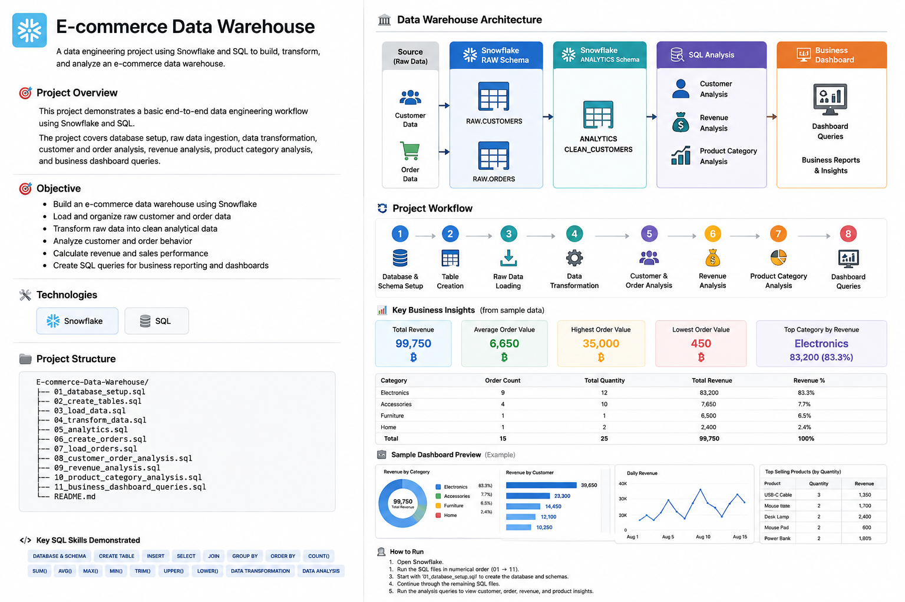

# E-commerce Data Warehouse

A data engineering project using Snowflake and SQL to build, transform, and analyze an e-commerce data warehouse.


## Project Overview

This project demonstrates a basic end-to-end data engineering workflow using Snowflake and SQL.

The project covers database setup, raw data ingestion, data transformation, customer and order analysis, revenue analysis, product category analysis, and business dashboard queries.

## Objective

- Build an e-commerce data warehouse using Snowflake
- Load and organize raw customer and order data
- Transform raw data into clean analytical data
- Analyze customer and order behavior
- Calculate revenue and sales performance
- Create SQL queries for business reporting and dashboards

  ## Key Business Insights

Based on the sample e-commerce dataset:

- Total Revenue: 99,750 THB
- Average Order Value: 6,650 THB
- Highest Order Value: 35,000 THB
- Lowest Order Value: 450 THB
- Top Category by Revenue: Electronics
- Electronics generated 83.3% of total revenue

## Technologies

- Snowflake
- SQL

## Data Warehouse Workflow

```text
Raw Data
   ↓
Database & Schema Setup
   ↓
Table Creation
   ↓
Data Loading
   ↓
Data Transformation
   ↓
Customer & Order Analysis
   ↓
Revenue Analysis
   ↓
Product Category Analysis
   ↓
Business Dashboard Queries
